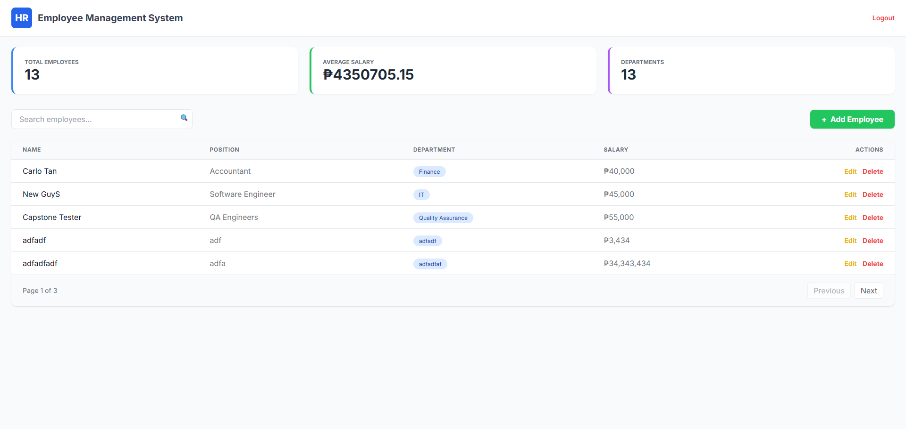
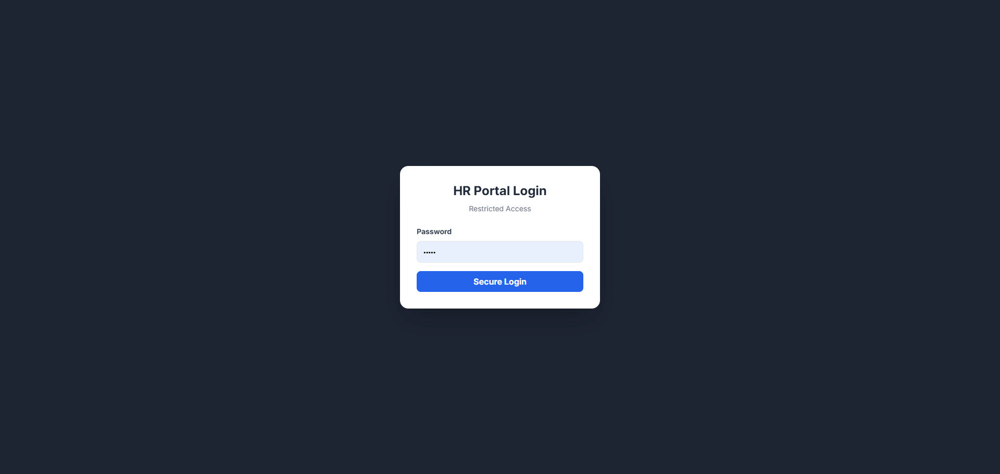
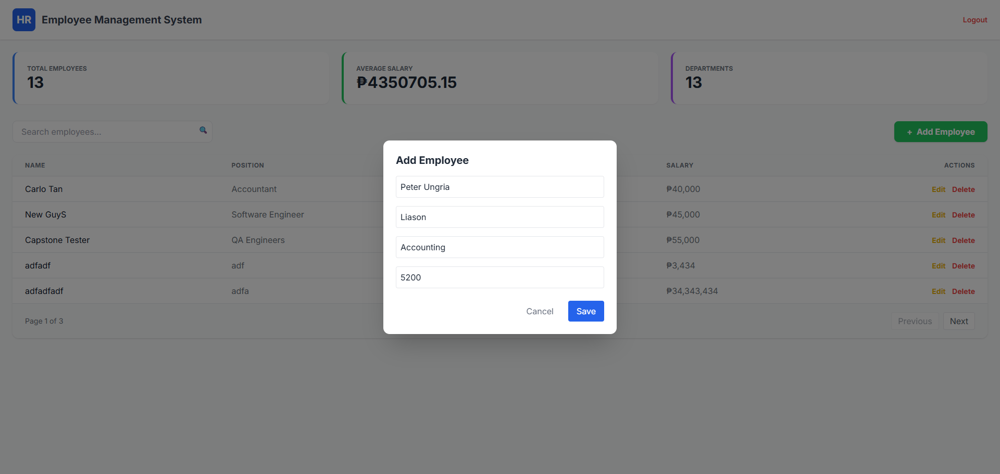
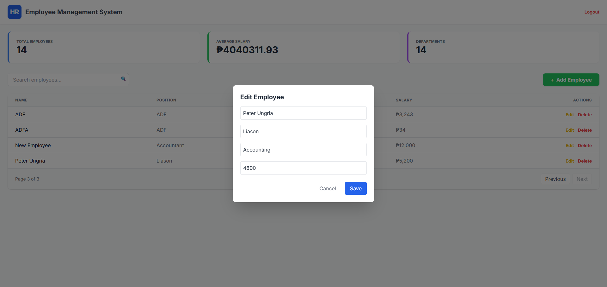
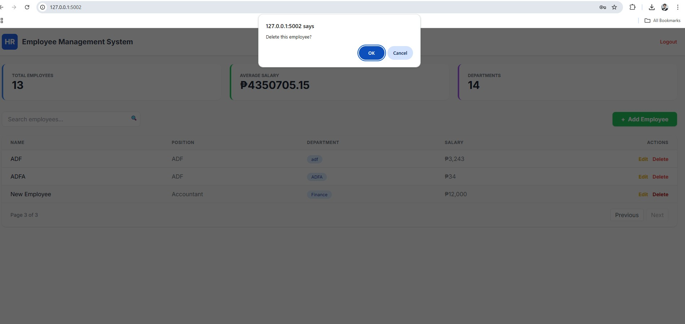

# Employee Management System API (Capstone Project)

A Flask-based REST API for managing employee records, departments, and salary statistics. This project uses JWT authentication and MySQL.

## 💻 System Requirements

Before running this project, ensure you have the following installed:
* **Python 3.8+**
* **MySQL Server** (Running locally or remotely)
* **Git**
* **VS Code** (or any Code Editor)
* **Postman / Thunder Client** (For API Testing)

---

## 🛠️ Installation & Setup

### 1. Clone the Repository
```bash
git clone https://github.com/gestaacinc/cfbautistaCapstone.git
cd cfbautistaCapstone

### 2\. Create & Activate Virtual Environment

**Windows:**
python -m venv appvenv
appvenv\Scripts\activate
```
### 3\. Install Dependencies

```bash
pip install -r requirements.txt
```

### 4. Database Setup

1. **Import the Database**
   - Open MySQL Workbench, phpMyAdmin, or any MySQL client.
   - Create a new database named `company_db`.
   - Import the SQL file located at: `data/company_db.sql`.

2. **Configure Credentials**
   - A `.env` file is included in the clone repository, make sure that this in the root directory.
   ```env
   API_SECRET_TOKEN=webTraining
   DB_HOST=127.0.0.1
   DB_USER=root
   DB_PASSWORD=your_password_here
   DB_NAME=company_db

### 5\. Run the Application

```bash
python capstone_api.py
```

Server will start at: `http://127.0.0.1:5002`

-----

## 📡 API Endpoints

**Auth:** All endpoints (except Login) require header `Authorization: Bearer <token>`

| Method | Endpoint | Function | Body / Params |
| :--- | :--- | :--- | :--- |
| **POST** | `/api/login` | **Get Token** | `{"password": "admin"}` |
| **GET** | `/api/stats` | **Dashboard** | Returns total stats. |
| **GET** | `/api/employees` | **List / Search** | `?page=1` OR `?search=name` |
| **POST** | `/api/employees` | **Create** | JSON with name, position, salary. |
| **PUT** | `/api/employees` | **Update** | `?id=101` + JSON Body. |
| **DELETE** | `/api/employees` | **Delete** | `?id=101` |

-----

## 📸 Frontend Integration Screenshots

### 1. API Landing Page


### 2. Authentication (Login)


### 3. Creating Data


### 4. Updating Data


### 5. Deleting Data


-----

## 👤 Author

**cfbautista**
 
